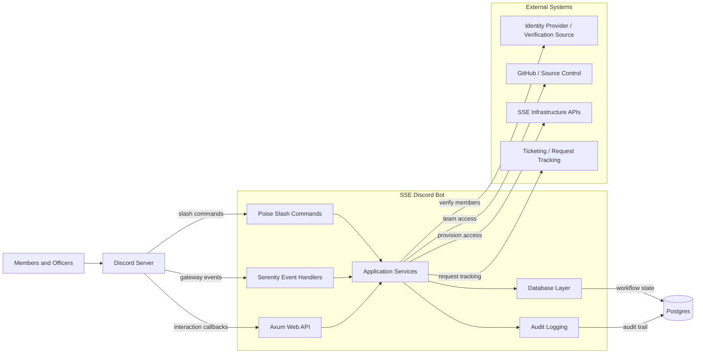

# SSE Discord Bot

The SSE Discord Bot is a Rust service for managing Discord-based onboarding, verification, and infrastructure access workflows for the SSE community. Discord is the primary user interface, but it should not become the source of truth for membership, verification, or infrastructure permissions. The bot coordinates user-facing Discord interactions with persisted workflow state and auditable integrations with SSE infrastructure systems.

See [ROADMAP.md](ROADMAP.md) for the current implementation status, release milestones, and definition of done.

The bot is built around `poise` and `serenity`. Poise provides the command framework for slash commands and typed command handlers, while Serenity provides lower-level Discord API access for guild events, roles, member state, and interactions. The service runs on Tokio, is incrementally moving workflow state into Postgres, and is planned to expose a small Axum web API for health checks and external callbacks before being deployed as a containerized service.

## Architecture



The bot is divided into five main parts:

- **Commands:** Slash-command entry points for verification, onboarding, admin review, and infrastructure access requests.
- **Events:** Discord guild event handling for member joins, role changes, and lifecycle events that should trigger workflow updates.
- **Services:** Business logic for verification, onboarding, approval flows, and infrastructure provisioning.
- **Database:** Postgres-backed persistence for workflow state, verification attempts, access requests, and audit history.
- **Web API:** Axum endpoints for health checks, OAuth callbacks, webhooks, and future Discord Linked Roles support.

## Planned Stack

| Concern | Choice | Purpose |
| --- | --- | --- |
| Language | Rust | Reliable async service with strong type safety |
| Discord framework | Poise | Slash commands and ergonomic command handlers |
| Discord API | Serenity | Gateway events, roles, guild members, and lower-level API access |
| Runtime | Tokio | Async runtime for Discord, web, and database work |
| Web API | Axum | Health checks, callbacks, OAuth redirects, and webhooks |
| Database | Postgres | Durable workflow, verification, and audit state |
| SQL access | SQLx | Compile-time checked SQL and migrations |
| Configuration | Environment variables, `config`, `dotenvy` | Local and production configuration |
| Secrets | `secrecy` and deployment-managed secrets | Discord tokens, database URLs, OAuth credentials |
| Observability | `tracing` | Structured logs and operational debugging |
| Deployment | Docker/container first | Portable deployment to SSE-managed infra or common hosts |

## Core Workflows

### Verification

Verification starts in Discord with a slash command or button-driven interaction. The bot records the verification attempt, checks the user against an approved verification source, and assigns the verified role only after the workflow succeeds.

Initial verification can be implemented with a Discord-native flow using ephemeral responses, buttons, and modals. Stronger checks can be added later through OAuth, invite codes, CAPTCHA-backed web flows, or Discord Linked Roles.

### Onboarding

Onboarding is modeled as an explicit workflow instead of a one-off command. A member requests access, the bot persists the request, officers review it, and approved actions are executed through service adapters.

Examples of future onboarding actions include GitHub organization invites, team membership updates, cloud or lab infrastructure access requests, documentation links, and ticket creation.

### Admin and Audit

Privileged actions should require explicit officer/admin commands and should be written to an audit trail. The audit trail should include the Discord actor, target user, action type, timestamp, request state, and external system result when applicable.

## Design Principles

- Prefer slash commands and Discord interactions over message-prefix commands.
- Avoid requiring the Discord message content privileged intent unless a future feature truly needs it.
- Keep Discord as the interface, not the database of record.
- Keep infrastructure-specific actions behind service adapters.
- Make verification, onboarding, and role changes replayable, reviewable, and auditable.
- Keep deployment portable; do not bake Shuttle or any single hosting platform into core application logic.

## Local Development

This repository currently contains the initial Rust project skeleton. The intended local development shape is:

```sh
cargo fmt
cargo clippy
cargo test
cargo run
```

Expected local configuration will include:

- `DISCORD_TOKEN`
- `DATABASE_URL`
- `RUST_LOG`
- OAuth or verification provider credentials as verification integrations are added

## Testing Strategy

- Unit test verification and onboarding state machines without making Discord API calls.
- Integration test database repositories and migrations against Postgres.
- Add smoke tests for Axum health and callback endpoints.
- Mock Discord-facing role assignment and interaction boundaries.
- Manually test bot behavior in a private Discord test server before production use.
